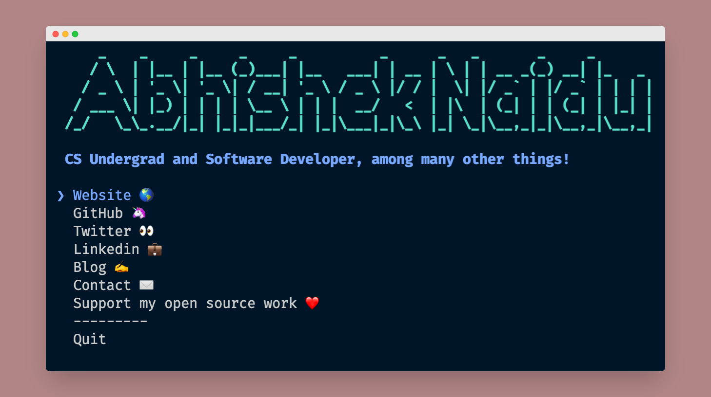

<h1 align="center">abhishek garg</h1>
<i>
<p align="center">The <a href="https://iamabhishekgarg.tech">
    Abhishek Garg
  </a> CLI</p>
</i>
<div align="center">
  <a href="https://www.npmjs.com/package/abhishekgarg">
    
  </a>
  </a>
  

  <a href="https://twitter.com/abhigarg1997">
     
  </a>
</div>

<hr />
<div align="center">

</div>

## Table of Contents

- [Installation](#installation)
- [Built With](#libraries)
- [LICENSE](#license)

## Installation

Ensure you have [Node.js](https://nodejs.org) 10 or later installed. Then run the following:

```
npx abhishekgarg
```

## Built With

- `import-jsx` - Require and transpile JSX on the fly
- `ink` - React for interactive command-line apps
- `ink-select-input` - Select input component for Ink
- `meow` - CLI app helper
- `node-banner` - banners for CLI tool
- `open` - Open stuff like URLs, files, executables. Cross-platform.
- `react` - Frontend Framework

## License

[](https://creativecommons.org/publicdomain/zero/1.0/)

To the extent possible under law, [Abhishek Garg ](https://iamabhishekgarg.tech/) has waived all copyright and related or neighboring rights to this work.

_Inspired by [Sindre Sorhus](https://github.com/sindresorhus) , [Abhijith Vijayan](https://github.com/abhijithvijayan)_
